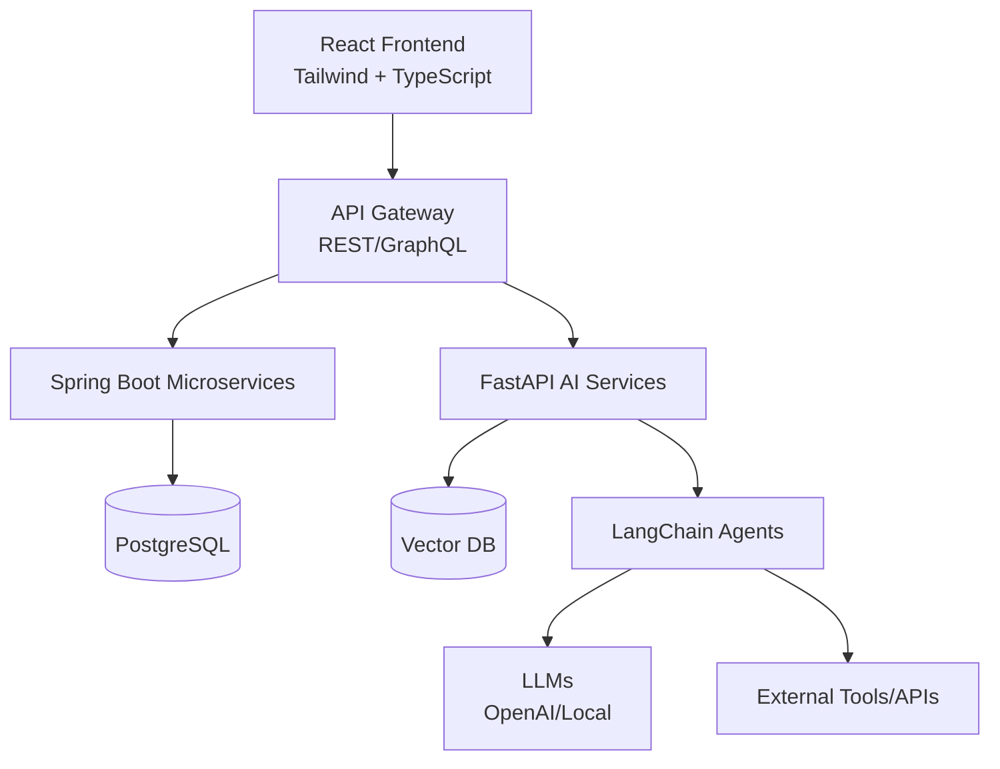

```markdown
# Maluleke Kurhula Success
## Full-Stack AI Engineer | LangChain + React + Spring Boot

<p align="center">
  
</p>

<p align="center">
  <a href="https://za.linkedin.com/in/kurhula-success-maluleke-32153231a"></a>
  <a href="mailto:kurhula04s@gmail.com"></a>
  <a href="https://wa.me/27640708649"></a>
  
  
</p>

---

## 🎯 Professional Summary

> **Full-Stack AI Engineer** bridging traditional software engineering with modern AI capabilities. I build **production-ready applications** using **React** and **Spring Boot**, while integrating **LangChain agents**, **RAG systems**, and **LLM workflows** that solve real business problems.

My focus is on **practical AI**—not just proofs of concept, but observable, testable, and scalable systems that deliver measurable value.

---

## 🧠 Core Competencies

```javascript
const kurhula = {
  role: "Full-Stack AI Engineer",
  focus: [
    "AI Agent Development (LangChain/LangChain4j)",
    "RAG Systems & Vector Databases", 
    "React + Tailwind Frontend",
    "Spring Boot Microservices",
    "Data Architecture"
  ],
  philosophy: "Production-ready AI starts with solid engineering fundamentals",
  currentlyLearning: [
    "Multi-agent Orchestration",
    "Fine-tuning LLMs",
    "Kubernetes for AI Workloads"
  ],
  lookingFor: "AI-forward engineering roles with real-world impact"
};
```

---

## 🛠 Technical Arsenal

### **AI Engineering Stack**


### **Vector Databases & Search**


### **Frontend Development**


### **Backend Engineering**


### **Database & Data Layer**


### **API Design & Security**


### **DevOps & Infrastructure**


### **System Languages**


---

## 🤖 AI Engineering Focus

### Agentic Systems
- **LangChain/LangChain4j** for agent orchestration and tool use
- **Chain-of-thought reasoning** with planning algorithms
- **Memory modules** (conversation buffer, vector store, entity memory)
- **Multi-agent collaboration** patterns

### Retrieval-Augmented Generation
- **Document chunking strategies** (semantic, recursive, token-based)
- **Embedding models** (OpenAI, Hugging Face, local)
- **Vector database optimization** (indexing, filtering, hybrid search)
- **Citation & grounding** to reduce hallucinations

### Production AI Patterns
- **Confidence scoring** with fallback workflows
- **Human-in-the-loop** review for sensitive operations
- **Observability** (token usage, latency, retrieval quality)
- **A/B testing** prompt versions and model selection

---

## 🏗 Architecture & Design Principles



- **Clean Architecture** - Separation of concerns across AI and traditional services
- **API-First Development** - Consistent contracts between frontend and AI services
- **Observability by Design** - Monitoring token usage, latency, and retrieval quality
- **Security First** - Authentication, rate limiting, and PII handling for AI features

---

## 🔥 Signature Projects

### 🧠 AI Research Assistant Platform
**Stack:** React + Tailwind | Spring Boot | LangChain4j | ChromaDB | OpenAI

Enterprise RAG system processing technical documents and generating research briefs:
- **Intelligent chunking** with overlap strategies for context preservation
- **Hybrid search** (BM25 + semantic) with reranking
- **Map-reduce summarization** for large document sets
- **Citation traceability** with source ranking
- **Streaming responses** with incremental UI updates

### 🤖 Agentic Customer Support Bot
**Stack:** Next.js | FastAPI | LangChain | Weaviate | Ollama

Autonomous support agent with confidence-based escalation:
- **Retrieval-augmented generation** from knowledge base
- **Confidence thresholds** with "I don't know" handling
- **Ticket creation** for low-confidence queries
- **Feedback loop** for continuous improvement
- **Conversation memory** with vector storage

### 📄 Document Field Extraction Pipeline
**Stack:** React | Spring Boot | LangChain4j | Tesseract OCR | PostgreSQL

Production pipeline for automated invoice processing:
- **Multi-format ingestion** (PDF, images, scanned docs)
- **Schema-based extraction** with validation rules
- **PII redaction** before LLM processing
- **Human review interface** with audit logging
- **Confidence scoring** and manual override

### ⚡ Real-Time Meeting Intelligence
**Stack:** React + Tailwind | Spring Boot | Spring AI | WebSockets

Streaming application that transforms meeting transcripts:
- **Real-time transcription** processing via WebSockets
- **Action item extraction** with owner/deadline detection
- **Sentiment analysis** across conversation segments
- **Session persistence** with searchable history
- **Live UI updates** as processing occurs

### 🚀 Full-Stack Web Platform
**Stack:** React | Spring Boot | PostgreSQL | Docker | JWT

Scalable web application with traditional CRUD operations:
- **RESTful APIs** with comprehensive security
- **Responsive React components** with Tailwind styling
- **Role-based access control** (Admin/User/Manager)
- **Containerized deployment** with Docker Compose
- **CI/CD pipeline** via GitHub Actions

---

## 📈 Development Philosophy

> **"Production AI is 10% model and 90% engineering infrastructure."**

| Principle | Practice |
|-----------|----------|
| **Observability First** | Monitor token usage, latency, retrieval quality |
| **Graceful Degradation** | Fallback flows when AI services fail |
| **Testable AI** | Evaluation datasets for retrieval and generation |
| **Cost Awareness** | Optimize token usage, cache common queries |
| **Security by Design** | PII redaction, rate limiting, access control |

---

## 📊 GitHub Analytics

<div align="center">
  
  
  <br/>
  
  <br/>
  
</div>

---

## 🌱 Current Focus Areas

```yaml
ai_engineering:
  agent_development:
    - Multi-agent orchestration with CrewAI
    - Tool-use optimization and function calling
    - Autonomous decision-making patterns
    
  rag_improvement:
    - Query transformation techniques
    - Re-ranking strategies
    - Fine-tuned embeddings
    
  production_ai:
    - LLM observability (LangSmith)
    - Cost optimization strategies
    - A/B testing for prompts

full_stack:
  frontend:
    - Next.js 14 App Router
    - Server components and streaming
    - Advanced Tailwind patterns
    
  backend:
    - Reactive Spring WebFlux
    - Event-driven architecture with Kafka
    - GraphQL federation

infrastructure:
  - Kubernetes for AI workloads
  - Vector database scaling
  - CI/CD for ML models
```

---

## 🎯 What I Bring to Your Team

✅ **Production AI Experience** - Not just notebooks, but deployed systems with monitoring

✅ **Full-Stack Foundation** - AI features integrated into complete web applications

✅ **Clean Architecture** - Separated concerns between AI and traditional services

✅ **Cost-Conscious Design** - Optimized token usage and caching strategies

✅ **Observable Systems** - Monitoring retrieval quality, latency, and hallucination rates

✅ **Security Mindset** - PII handling, rate limiting, and access control for AI endpoints

✅ **Continuous Learning** - Staying current with rapidly evolving AI landscape

---

## 📫 Let's Build Something Intelligent

I'm actively seeking **AI-forward engineering roles** where I can:
- Build **production AI systems** that deliver real business value
- Work with **modern stacks** (React + Spring Boot + LangChain)
- Collaborate with **experienced teams** on challenging problems
- Grow into **AI architecture and technical leadership**

<p align="center">
  <a href="https://za.linkedin.com/in/kurhula-success-maluleke-32153231a">
    
  </a>
  <a href="mailto:kurhula04s@gmail.com">
    
  </a>
  <a href="https://wa.me/27640708649">
    
  </a>
</p>

<p align="center">
  <i>📧 kurhula04s@gmail.com | 📱 +27 64 070 8649 | 🌍 South Africa (GMT+2)</i>
</p>

---

## 📊 Quick Facts

```javascript
const kurhula = {
  location: "South Africa",
  timezone: "GMT+2",
  preferredStack: ["React", "Spring Boot", "LangChain", "PostgreSQL", "Tailwind"],
  currentlyBuilding: "Production AI agents with LangChain4j",
  favoriteTools: ["VS Code", "IntelliJ", "Docker Desktop", "Postman", "LangSmith"],
  aiPhilosophy: "Models are commodities, engineering is the differentiator",
  coffeeRequired: true,
  problemSolving: "Always ON"
};
```

---

<p align="center">
  
</p>

<p align="center">
  <i>⚡ Building production AI systems with React, Spring Boot, and LangChain ⚡</i>
  <br/>
  <i>⭐ Star repositories you find interesting | Let's connect and build something great ⭐</i>
</p>
```
