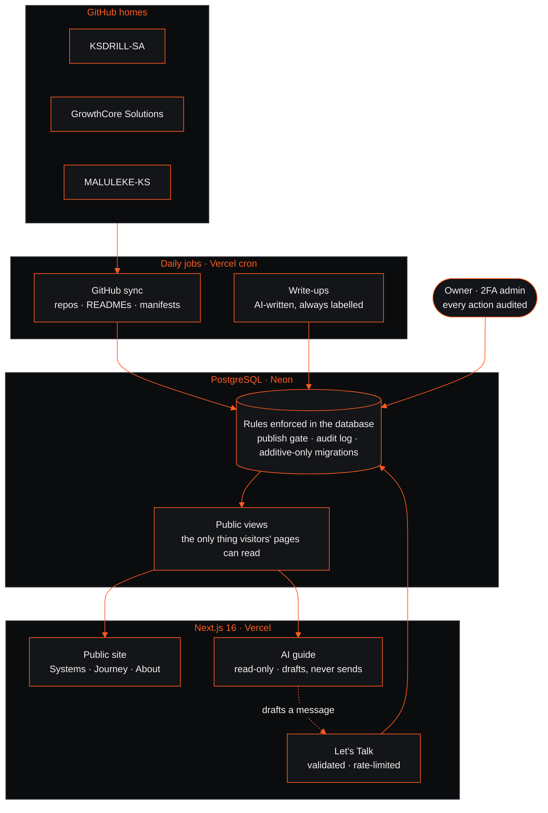
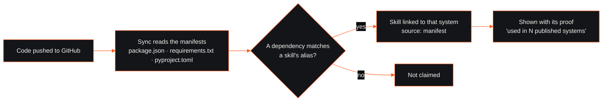

  

 

&nbsp;

&nbsp;

  

&nbsp;

&nbsp;

&nbsp;

---

## About

I'm a final-year Computer Science and Mathematics student building production-grade systems — full-stack web, AI integration and enterprise automation — through **[KSDRILL-SA](https://github.com/KSDRILL-SA)** and **[GrowthCore Solutions](https://github.com/GrowthCore-Solutions)**. Architecture and design come before any code is written; one system gets built at a time, no forward dependencies, no shortcuts taken to hit a date instead of a standard.

**[My platform](https://maluleke-ks.vercel.app)** is itself one of those systems: a database-backed, full-stack application, not a static portfolio describing one. It publishes every system straight from GitHub, proves each skill from the code that uses it, and has an AI guide that answers from the site's own data — and drafts, never sends.

---

## Building now

| | System | What it is | Built with |
| :---: | :--- | :--- | :--- |
| 🟠 | **[FundsLink Academy](https://maluleke-ks.vercel.app/systems/fundslink-academy)** · KSDRILL-SA | EdTech — connecting students to bursaries, scholarships and funding opportunities | Angular · FastAPI · TypeScript · Python · Tailwind |
| 🟠 | **[Governova](https://maluleke-ks.vercel.app/systems/governova)** · KSDRILL-SA | A complete governance framework for building production-grade systems — 10 constitutions, 355 rules | Python |

## Selected work

| System | What it is | Built with | |
| :--- | :--- | :--- | :---: |
| **[MALULEKE-KS](https://maluleke-ks.vercel.app/systems/maluleke-ks)** | This platform — every claim it makes is enforced by real rules, tests and evidence; an AI guide; GitHub-synced catalog; 2FA admin | Next.js 16 · PostgreSQL (Neon) · Prisma · Vercel AI SDK · Tailwind · Playwright | [Live](https://maluleke-ks.vercel.app) |
| **[Xkimi Xa Mali](https://maluleke-ks.vercel.app/systems/xkimi-xa-mali)** · flagship | Fintech — a private savings collective, built for real money and real family stakes | Next.js · PostgreSQL · Prisma · Inngest · Redis · Sentry | [Live](https://xkimixamali.co.za) |
| **[Sunduza Architectural](https://maluleke-ks.vercel.app/systems/sunduza-architectural)** · client | Architecture & Construction — architectural and project-management systems for a construction client | Next.js · PostgreSQL · Prisma · Redis · Tailwind | [Live](https://sunduza-architectural.vercel.app) |

Plus AI, algorithms and networking work — transformer vs rule-based chatbots, real-time YOLOv8 detection, network clustering, graph search, route optimisation, network design — **[all systems →](https://maluleke-ks.vercel.app/systems)**

---

## How I build

| | Principle | |
| :---: | :--- | :--- |
| 01 | **Make it exist first** | Make it exist now; make it beautiful later. A working version in front of real people beats a perfect one that never ships. |
| 02 | **Extension over modification** | Anything expected to grow lives in data, never in a hard-coded list. |
| 03 | **Smart, not hard** | Buy the commodity, build the differentiated. |
| 04 | **Controlled imperfection** | Failures made predictable and traceable, not chased into an impossible zero. |
| 05 | **Permission boundaries** | No AI acts autonomously on anything that matters. |

Each principle links to the code that proves it — **[the method, with evidence →](https://maluleke-ks.vercel.app/about#method)**

---

## Stack

Ranked by use. Which published systems prove each one — **[skills, with proof →](https://maluleke-ks.vercel.app/about)**

**Languages** &nbsp; 
     

**Frontend** &nbsp; 
      

**Design & UI** &nbsp; 
   

**Backend** &nbsp; 
    

**Data** &nbsp; 
    

**AI / ML** &nbsp; 
     

**Testing** &nbsp; 
   -131519?style=flat-square)

**Infrastructure & hosting** &nbsp; 
    

---

## Where the code lives

| | Home | Role | Focus |
| :---: | :--- | :--- | :--- |
|  | **[KSDRILL-SA](https://github.com/KSDRILL-SA)** | Founder & Principal Engineer | Fintech · EdTech · AI systems · engineering governance |
|  | **[GrowthCore Solutions](https://github.com/GrowthCore-Solutions)** | Co-founder | Web development · digital marketing · customer acquisition · analytics |
|  | **[MALULEKE-KS](https://github.com/MALULEKE-KS)** | Personal | This platform · AI, algorithms and networking work |

> **This repository is the platform.** Besides this profile, it holds the full source of [maluleke-ks.vercel.app](https://maluleke-ks.vercel.app): Next.js 16, PostgreSQL with rules enforced in the database, Prisma, an audited 2FA admin, a GitHub sync and the AI guide — with its governing documents in [`docs/`](docs).

### How the platform works

```mermaid
%%{init: {'theme':'base','themeVariables':{'primaryColor':'#131519','primaryTextColor':'#f4f2ee','primaryBorderColor':'#ff5b1f','lineColor':'#ff5b1f','secondaryColor':'#1c1f24','tertiaryColor':'#0b0c0e','clusterBkg':'#0b0c0e','clusterBorder':'#3a3f47','titleColor':'#ff5b1f','edgeLabelBackground':'#0b0c0e','fontFamily':'ui-monospace, SFMono-Regular, Menlo, monospace','fontSize':'14px'}}}%%
flowchart TB
  subgraph GH["GitHub homes"]
    direction LR
    K["KSDRILL-SA"]
    G["GrowthCore Solutions"]
    M["MALULEKE-KS"]
  end
  subgraph JOBS["Daily jobs · Vercel cron"]
    direction LR
    S["GitHub sync<br/>repos · READMEs · manifests"]
    W["Write-ups<br/>AI-written, always labelled"]
  end
  subgraph DB["PostgreSQL · Neon"]
    direction LR
    R[("Rules enforced in the database<br/>publish gate · audit log · additive-only migrations")]
    V["Public views<br/>the only thing visitors' pages can read"]
  end
  subgraph WEB["Next.js 16 · Vercel"]
    direction LR
    P["Public site<br/>Systems · Journey · About"]
    A["AI guide<br/>read-only · drafts, never sends"]
    L["Let's Talk<br/>validated · rate-limited"]
  end
  O(["Owner · 2FA admin<br/>every action audited"])
  GH --> S --> R
  W --> R
  R --> V --> P
  V --> A
  A -. drafts a message .-> L
  L --> R
  O --> R
```

### From code to claim

```mermaid
%%{init: {'theme':'base','themeVariables':{'primaryColor':'#131519','primaryTextColor':'#f4f2ee','primaryBorderColor':'#ff5b1f','lineColor':'#ff5b1f','secondaryColor':'#1c1f24','tertiaryColor':'#0b0c0e','clusterBkg':'#0b0c0e','clusterBorder':'#3a3f47','titleColor':'#ff5b1f','edgeLabelBackground':'#0b0c0e','fontFamily':'ui-monospace, SFMono-Regular, Menlo, monospace','fontSize':'14px'}}}%%
flowchart LR
  C["Code pushed to GitHub"] --> S["Sync reads the manifests<br/>package.json · requirements.txt · pyproject.toml"]
  S --> E{"A dependency matches<br/>a skill's alias?"}
  E -- yes --> L["Skill linked to that system<br/>source: manifest"]
  E -- no --> X["Not claimed"]
  L --> P["Shown with its proof<br/>'used in N published systems'"]
```

Nothing on the site is typed in as a claim: a skill is shown as proven only when a published system's own code uses it, and it disappears when the dependency does.

---

## Open to

**Roles:** Full-stack &nbsp;·&nbsp; Backend &nbsp;·&nbsp; AI/ML &nbsp;·&nbsp; Systems architecture

**[Hiring →](https://maluleke-ks.vercel.app/contact?about=recruitment)** &nbsp;·&nbsp; **[A project →](https://maluleke-ks.vercel.app/contact?about=service)** &nbsp;·&nbsp; **[Collaboration →](https://maluleke-ks.vercel.app/contact?about=collaboration)**

Every message is read by me — no account needed.

---

  <em>The sky is the limit — KSDRILL-SA</em>

  

